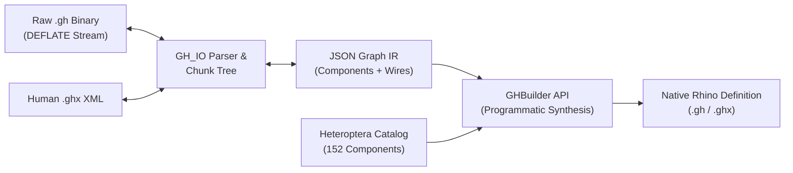
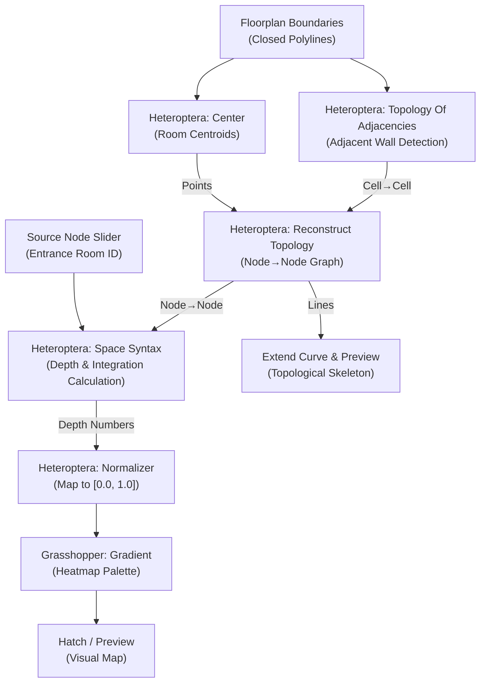

# Grasshopper AI Toolkit 🦗⚡

[](LICENSE)
[](https://www.python.org/)
[]()
[](https://www.rhino3d.com/)
[](docs/HETEROPTERA_REFERENCE.md)

**Grasshopper AI Toolkit** is a zero-external-dependency Python library, CLI, and Agent Skill for **inspecting, decompiling, converting, and programmatically synthesizing** Rhino Grasshopper definitions (`.gh` binary and `.ghx` XML).

It comes with **deep integration for the Heteroptera plugin** (152 components across graph networks, space syntax, vector fields, and stochastic allocators) and an architectural taxonomy derived from **193 production definitions**.

---

## 🚀 Key Capabilities

* ⚡ **Zero External Dependencies**: Decompresses binary `.gh` files directly via raw DEFLATE streams (`zlib.decompress(data, -15)`). No Rhino license or COM/.NET runtime required for file operations.
* 🔄 **Lossless Bidirectional Conversion**: Roundtrip seamlessly between `.gh` (binary), `.ghx` (human-readable XML), and clean JSON Graph IR.
* 🧠 **Heteroptera Plugin Mastery**: 152 indexed components with complete input/output port types, data tree access modes (`item`, `list`, `tree`), and canonical topological recipes.
* 🛠️ **Programmatic Graph Synthesis (`GHBuilder`)**: Build valid, ready-to-open Grasshopper definitions in Python with automatic canvas spacing and topological wiring.
* 📦 **Agent Skill Ready**: Includes a drop-in Antigravity / Gemini Agent Skill (`skill/`) to empower AI coding assistants with Grasshopper definition authoring.
* 📜 **Automated Script Extractor**: Batch-extract embedded GhPython (`.py`) and C# (`.cs`) script components from hundreds of definitions into standalone source files.

---

## 📐 The Architecture: Directed Acyclic Graph (DAG)



---

## 📦 Installation

Choose the installation method that fits your workflow:

### Option 1: Direct Install via `pip` (Recommended for Python users)
Install directly from GitHub into your current Python environment:
```bash
pip install git+https://github.com/studiohelioripple/grasshopper-ai-toolkit.git
```

### Option 2: Clone & Development Install (Editable mode)
Clone the repository to inspect the code, run examples, or contribute:
```bash
git clone https://github.com/studiohelioripple/grasshopper-ai-toolkit.git
cd grasshopper-ai-toolkit

# Install in editable mode
pip install -e .
```

### Option 3: Zero-Install Standalone Usage (No `pip` or Virtualenv required)
Because Grasshopper AI Toolkit relies **strictly on standard Python libraries** (`zlib`, `struct`, `xml.etree`, `json`, `argparse`), you can execute it immediately out-of-the-box without installing anything:
```bash
git clone https://github.com/studiohelioripple/grasshopper-ai-toolkit.git
cd grasshopper-ai-toolkit

# Run via module invocation:
python3 -m gh_toolkit.cli --help

# Or run the standalone script:
python3 tools/gh_toolkit.py --help
```

### Option 4: Install as an Antigravity / Gemini Agent Skill
Deploy the toolkit as a native skill for Google Antigravity or Gemini AI coding agents:
```bash
# Copy the packaged skill definition into your agent skills directory
mkdir -p ~/.gemini/config/skills/grasshopper
cp -r skill/* ~/.gemini/config/skills/grasshopper/
```
Once installed, your agent will automatically use the toolkit to decompress `.gh` files, validate Heteroptera topologies, and author Grasshopper graphs.

---

### ✅ Verify Installation
Verify that the CLI is working properly:
```bash
gh-toolkit --help
```
You should see:
```text
usage: gh-toolkit [-h] {info,to-ghx,to-gh,to-json,extract-scripts,heteroptera} ...

Grasshopper AI Toolkit - Zero-dependency CLI for inspecting, converting,
and synthesizing Grasshopper (.gh / .ghx) definitions.
```


---

## 💻 CLI Quickstart

The package installs the `gh-toolkit` command:

### 1. Inspect Definition Metadata & Components
```bash
gh-toolkit info path/to/definition.gh
```
```
File:                  definition.gh
Definition Name:       SpaceSyntaxAnalysis
Total Components:      28
Total Wires:           34
Canvas Components Sample:
  [c_e06392c4] Space Syntax ('SpaceSyntax') - 3 in, 2 out
  [c_ca0a748f] Topology Of Adjacencies ('Adjacency') - 3 in, 1 out
  [c_f13e7874] Reconstruct Topology ('ReconTopo') - 4 in, 4 out
```

### 2. Format Conversion
```bash
# Convert binary .gh to readable XML .ghx
gh-toolkit to-ghx input.gh output.ghx

# Convert XML .ghx to compressed binary .gh
gh-toolkit to-gh input.ghx output.gh

# Export definition as lightweight JSON Graph IR
gh-toolkit to-json input.gh graph.json
```

### 3. Extract Embedded Python and C# Scripts
```bash
# Batch extract all embedded GhPython and C# scripts from a directory
gh-toolkit extract-scripts ./definitions --out ./extracted_scripts
```

### 4. Heteroptera Plugin CLI
```bash
# Query any component schema and port specifications
gh-toolkit heteroptera --info "Space Syntax"

# List components by subcategory (networks, vectors, uncertainty, streaming, geometry, maths, utilities)
gh-toolkit heteroptera --list networks

# Audit any definition for Heteroptera component usage
gh-toolkit heteroptera --audit topology-spacesyntax.gh

# Display canonical wiring recipes
gh-toolkit heteroptera --recipes
```

---

## 🐍 Python API Examples

### Example 1: Synthesize a Space Syntax Pipeline in 5 Lines
```python
from gh_toolkit import GHBuilder

builder = GHBuilder(name="AutomatedSpaceSyntax")

# One-line canonical Space Syntax synthesis
pipeline_ids = builder.add_space_syntax_pipeline(start_pivot=(100, 100))

# Save directly to native formats
builder.save_ghx("SpaceSyntax.ghx")
builder.save_gh("SpaceSyntax.gh")
```

### Example 2: Programmatic Heteroptera Assembly with Sliders & Scripts
```python
from gh_toolkit import GHBuilder

builder = GHBuilder(name="ParametricMasonry")

# 1. Add interactive sliders
builder.add_slider("s_cols", "Columns", 5, 50, 20, (100, 100))
builder.add_slider("s_rows", "Rows", 2, 30, 10, (100, 180))
builder.add_slider("s_jitter", "Jitter", 0.0, 1.0, 0.25, (100, 260))

# 2. Add Heteroptera components
builder.add_heteroptera_component("Careless Range", "careless", (340, 180))
builder.add_heteroptera_component("Slingshot Allocator", "slingshot", (560, 180))
builder.add_heteroptera_component("Symmetric Domain", "sym_dom", (780, 180))

# 3. Add embedded GhPython script node
builder.add_python_script(
    alias="py_bricks",
    code="""
import Rhino.Geometry as rg
# Logic for placing and rotating masonry blocks...
""",
    inputs=["cols", "rows", "jitter_vals"],
    outputs=["brick_boxes", "centers"],
    pivot=(1000, 150)
)

# 4. Wire ports topologically
builder.connect("s_cols.out", "py_bricks.cols")
builder.connect("s_rows.out", "py_bricks.rows")
builder.connect("s_jitter.out", "careless.Errancy")
builder.connect("careless.Range", "slingshot.Data")
builder.connect("slingshot.Data Tree", "sym_dom.Length")
builder.connect("sym_dom.Interval", "py_bricks.jitter_vals")

# 5. Save definition
builder.save_gh("StochasticMasonry.gh")
```

---

## 🏛️ Space Syntax Canonical Pipeline

Heteroptera is widely used for architectural spatial network analysis. The canonical Space Syntax pipeline is implemented as:



> **The Reconstruction Invariant**: Always pipe raw geometric adjacencies from `Topology Of Adjacencies.Cell→Cell` through `Reconstruct Topology` before feeding `Space Syntax.Node→Node`. This prevents runtime indexing failures on naked boundary edges.

---

## 📚 The 8 Functional Pillars

The toolkit was built from an analysis of **193 production Grasshopper definitions**:

| Pillar | File Count | Core Focus | Key Components |
|---|:---:|---|---|
| **Parametric Masonry & Bricks** | **56** | Stacking, gap variations, derotation & stone shop drawings | `Weighted Allocator`, `Slingshot Allocator`, `Careless Range`, `Freeze` |
| **Spatial Networks & Space Syntax** | **21** | Floorplan adjacency, integration, shortest routes | `Space Syntax`, `Topology Of Adjacencies`, `Reconstruct Topology`, `Normalizer` |
| **Facades & Envelopes** | **19** | Mondrian rhythms, window framing, vertical louvers | `Fast Sweep`, `Center`, `Cycle By Planar Mapping`, `Network From Lines` |
| **Vector Fields & Morphogenesis** | **19** | Particle flow, scutoid cells, Kangaroo physics | `Trap Goal`, `Align On Field Goal`, `Simplex Noise`, Kangaroo 2 |
| **GIS & Architectural Production** | **17** | Urban plots, Persian BIM tags, schedules & dimensions | `ToolsUnicode`, `Allocate By Key`, custom attribute bakers |
| **Tessellations & Islamic Patterns** | **16** | Girih, Parakeet patterns, Muqarnas, Escher morphs | Parakeet, `Geometric Cycles`, `Grid In Rectangle` |
| **Product Assemblies & Catalogs** | **13** | Modular product line matrices, shelving, taxonomy | `Allocate By Index`, `Seed Generator`, Block Instances |
| **Solvers & Combinatorics** | **10** | 8-Queens solvers, Möbius surfaces, HTTP web data | C# BruteEngines, GhPython, `Accord.dll`, `Http Request` |

*For complete catalog and files list, see [`docs/ARCHITECTURAL_PILLARS.md`](docs/ARCHITECTURAL_PILLARS.md).*

---

## 🤖 Antigravity / AI Agent Skill

This repository includes a compact, token-compressed Agent Skill in `skill/`:
- **`SKILL.md`**: Ultra-dense, token-optimized executive guide for AI coding assistants.
- **`references/`**: Modular deep knowledge bases:
  - `ARCHITECTURAL_RECIPES.md`: The 8 architectural pillars distilled from 193 definitions.
  - `SCRIPT_LIBRARY.md`: Curated, production-ready GhPython & C# scripts.
  - `COMPONENT_INDEX.md`: Compact GUID & port quick-reference.
- **`resources/compact_index.json`**: Lightweight (46 KB) JSON lookup index for high-speed agent queries.
- **`scripts/gh_toolkit.py`**: Portable execution engine.

To install this skill into your Antigravity agent environment:
```bash
cp -r skill/ ~/.gemini/config/skills/grasshopper/
```

---

## 📂 Project Structure

```
grasshopper-ai-toolkit/
├── README.md                      # Documentation & quickstart
├── LICENSE                        # MIT License
├── pyproject.toml                 # Package configuration
├── gh_toolkit/                    # Python package source code
│   ├── __init__.py                # Package exports
│   ├── core.py                    # Binary parser, models, DEFLATE engine
│   ├── builder.py                 # GHBuilder DAG synthesizer
│   ├── heteroptera.py             # Heteroptera bindings & recipes
│   └── cli.py                     # CLI entrypoint
├── docs/                          # Detailed guides & references
│   ├── ARCHITECTURAL_RECIPES.md   # Distilled recipes from 193 definitions
│   ├── SCRIPT_LIBRARY.md          # 128 curated GhPython & C# scripts
│   ├── COMPONENT_INDEX.md         # High-density GUID quick-reference
│   ├── HETEROPTERA_REFERENCE.md   # Complete 152-component reference
│   ├── ARCHITECTURAL_PILLARS.md   # 193-definition repository taxonomy
│   └── SPACE_SYNTAX_GUIDE.md      # Space Syntax architectural guide
├── examples/                      # Runnable synthesis scripts
│   ├── 01_space_syntax_pipeline.py
│   ├── 02_brick_allocation.py
│   └── outputs/                   # Generated sample definitions
├── tests/                         # Automated test suite
└── skill/                         # Compact, compressed Agent Skill bundle
    ├── SKILL.md                   # Dense executive guide
    ├── references/                # Modular knowledge base
    └── resources/                 # Compact offline schema catalogs
```

---

## 📄 License

This project is licensed under the [MIT License](LICENSE).
Grasshopper® and Rhino® are registered trademarks of Robert McNeel & Associates.
Heteroptera plugin is developed by Amin Bahrami.
