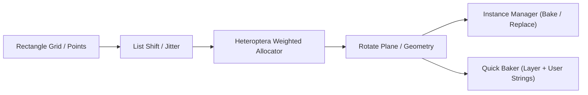
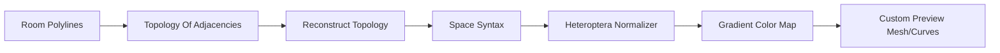

# Distilled Architectural Recipes & Wiring Patterns
> Synthesized from empirical analysis of 193 Grasshopper definitions across 8 architectural domains.

---

## 1. Parametric Masonry & Hanging Stones (Bond, Rotation & Allocation)

### Core Mechanics
* **Alternating Row Shifting**: In bond courses, offset every alternate row by half unit width:
  x_offset = (row_idx % 2) * (width / 2.0)
* **Rotation Pairing & Stochastic Gaps**:
  * Feed sequential brick indices into Heteroptera's `Weighted Allocator` or `Slingshot Allocator` to assign discrete angle steps (e.g., [0 deg, 5 deg, 10 deg, 15 deg]).
  * Use `Careless Range` to introduce natural fabrication jitter without collisions.
* **Block Instance Substitution**:
  * Replace heavy Brep geometry with lightweight Rhino Block definitions using `Instance Manager` (`Insert H_Blocks`, `Align bricks`).
* **Genome Parameter Encoding (Hexadecimal)**:
  * Extract slider tick ratios and boolean toggles into a hexadecimal configuration string for fast variant recall:
    ```csharp
    // Pack toggle bits and slider positions into hex genome
    for(int s = 0; s < Sliders.Count; s++) {
        int val = (int)Math.Round((double)Sliders[s].TickValue / Sliders[s].TickCount * 255.0);
        code += val.ToString("X2");
    }
    ```

### Canonical Wiring Pipeline


---

## 2. Spatial Networks & Space Syntax Floorplan Analysis

### Core Mechanics
* **Adjacency Extraction**: Extract room boundaries from architectural floorplan polylines using `Topology Of Adjacencies`.
* **Reconstruction Invariant**:
  > Always pipe `Topology Of Adjacencies.Cell->Cell` through `Reconstruct Topology` before feeding `Space Syntax.Node->Node`. This prevents runtime indexing failures on naked boundary edges.
* **Graph Traversal & Centrality**:
  * Pipe reconstructed network to `Space Syntax` component.
  * Extract **Integration** (accessibility) and **Choice** (flow betweenness).
  * Normalize outputs via Heteroptera's `Normalizer` to domain [0.0, 1.0].
  * Map normalized values to a color gradient and feed to `Custom Preview`.
* **Bubble Diagram Pruning**:
  * Filter null or unlinked circulation nodes with C# filter:
    `A = x.Paths.Where(i => !(x.Branch(i).Contains(-1)));`

### Canonical Wiring Pipeline


---

## 3. Architectural Facades, Window Framing & Slicing

### Core Mechanics
* **Contour & Offset Framing**:
  * Extract building envelope Brep -> Contour along Z axis at floor-to-floor intervals -> Offset Curve (interior glazing vs exterior mullion) -> Loft framing profile.
* **Non-Overlapping Glazing Intervals**:
  * When projecting multiple window openings onto facade spandrels, merge overlapping intervals with `Heteroptera.IntervalsUnion` (`conduit ramsar.gh`).
* **Cross-Sectional Dynamic Dimensioning**:
  * Intersect facade polylines with transverse planes:
    `Rhino.Geometry.Intersect.Intersection.CurvePlane(polyCurve, plane, 0.01)`
  * Project intersection points onto local coordinate axes to extract framing widths and heights dynamically (`Dimension.gh`).

---

## 4. Morphogenesis, Vector Fields & Attractor Relaxation

### Core Mechanics
* **Attractor Deformation & Falloff**:
  * Calculate Euclidean distance from sample points to attractor curves/points.
  * Remap distance values through `Graph Mapper` (Gaussian, Bezier, or Sigmoid) to define non-linear structural thickness or aperture openings.
* **Kangaroo 2 Particle Physics**:
  * Combine geometric constraints:
    * `Trap Goal` (keep points within boundary curve)
    * `Align On Field Goal` (orient particles along vector field)
    * `Length Goal` (spring networks for tensile membranes)
  * Solve iteratively with `Kangaroo2.Solver`.

---

## 5. GIS, Persian BIM & Urban Analysis

### Core Mechanics
* **Multilingual Typography (Persian / Arabic)**:
  * In projects with Farsi cadastral attributes (Rasht, Saveh, Ramsar), always pass strings through Heteroptera's `ToolsUnicode` before baking to prevent inverted or disconnected glyphs.
* **User Dictionary & BIM Schedule Extraction**:
  * Extract metadata directly from Rhino geometry attributes:
    `RhinoDocument.Objects.Find... Attributes.GetUserStrings()`
  * Format and compile into structured schedule panels using `Build Attribute` -> `Quick Baker`.

---

## 6. Modular Product Assemblies & DataTree Matrices

### Core Mechanics
* **Matrix Tree Manipulation**:
  * Use `ghpythonlib.treehelpers` (`th.tree_to_list`, `th.list_to_tree`) for nested product hierarchy conversions.
  * Branch addressing:
    * Level 0: Category (`{0}`)
    * Level 1: Sub-product (`{0;0}`)
    * Level 2: Component parts & variations (`{0;0;0}`)
* **Dynamic Tree Pruning**:
  * Clean empty branches and prune invalid indices using `Trim Tree` and `Split Tree`.

---

## 7. Algorithmic Solvers & Viewport Conduits

### Core Mechanics
* **Constraint Solvers (e.g. 8-Queens / Placement)**:
  * GhPython recursive backtracking engine to solve spatial layout constraints without geometric brute-force.
* **Custom Rhino Viewport Conduits**:
  * Override `Rhino.Display.DisplayPipeline` in GhPython or C# to draw custom HUDs, pie charts, and text tags directly in the viewport without creating persistent document objects.
