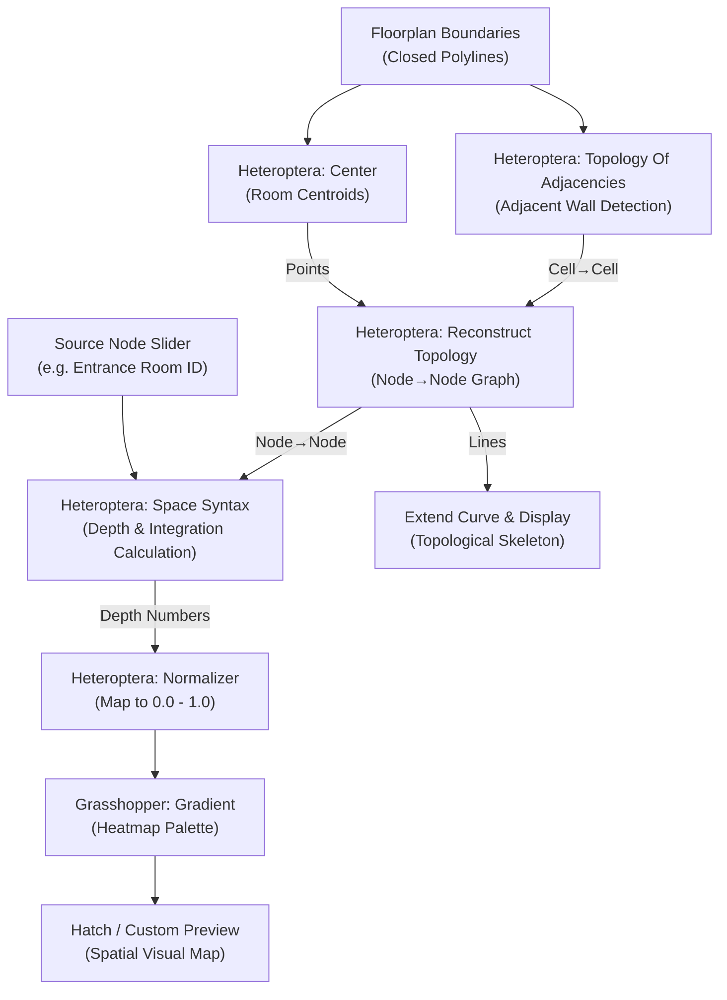
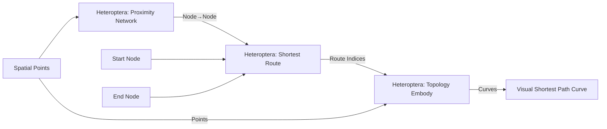
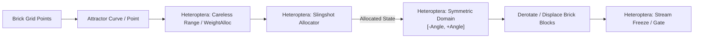

# Heteroptera Plugin Reference & Architectural Guide

Heteroptera is a specialized computational design and topological modeling plugin for Rhino Grasshopper developed by **Amin Bahrami**. It provides **152 specialized components** focusing on network topology, space syntax, vector/tensor fields, stochastic uncertainty, streaming data manipulation, domain mathematics, and architectural utility operations.

---

## 1. Core Topological Concepts & Data Tree Representations

Heteroptera introduces a consistent, mathematically rigorous convention for representing network topologies and graph data structures in Grasshopper Data Trees:

### 1.1 The Topological Data Convention
- **`Node→Node` (or `N→N`)**:
  - Represented as a Grasshopper Data Tree (`GH_Structure`) where the branch path `{i}` represents the index of the source node, and the branch items represent the indices of all neighbor nodes connected to it.
  - Example: Branch `{0}` containing `[1, 3]` means Node 0 is connected to Node 1 and Node 3.
- **`Edge→Node` (or `E→N`)**:
  - A Data Tree where branch `{e}` represents an edge index, containing a list of 2 node indices `[nodeA, nodeB]` defining the edge endpoints.
- **`Cell→Node` / `Cell→Cell`**:
  - Used in planar face cycles, bubble diagrams, and spatial zoning.
  - Branch `{c}` contains the ordered indices of nodes or adjacent cells defining the room or topological cell.
- **`BackNodes`**:
  - Predecessor indices used in traversal algorithms (e.g. breadth-first search, Dijkstra) to backtrack optimal paths.

---

## 2. Component Taxonomy & Subcategories (152 Components)

Heteroptera components are organized into 7 primary subcategories:

### 2.1 Networks & Topology (31 Components)
Specialized tools for graph generation, topological analysis, space syntax, cycle detection, and routing.

| Component | Nickname | GUID | Inputs | Outputs | Description |
|---|---|---|---|---|---|
| **Space Syntax** | `SpaceSyntax` | `d4077291-8c30-4313-8bb3-45a86138c521` | `Node→Node` (tree), `Source` (item), `Depth` (item) | `Node SpaceSyntax`, `Connection SpaceSyntax` | Computes topological integration, mean depth, choice, and connectivity for spatial networks. |
| **Topology Of Adjacencies** | `Adjacency` | `980bd972-3623-40a9-85d9-89807ce118c9` | `Polylines` (list), `Method` (item), `Tolerance` (item) | `Cell→Cell` | Computes topological adjacency between room or plot boundary polylines. |
| **Reconstruct Topology** | `ReconTopo` | `683305c6-fd18-4102-b142-f5c799d7069c` | `Node→Node` (tree), `Edge→Node` (tree), `Points (Optional)` (list), `Curves (Optional)` (list) | `Node→Node`, `Edge→Node`, `Points`, `Lines` | Re-indexes, validates, and aligns network topology with spatial geometry. |
| **Shortest Route** | `ShortRoute` | `992702c7-9416-4663-8be4-beb8521810ba` | `Node→Node` (tree), `Start` (item), `End` (item), `Weights` (list) | `Route`, `Length`, `Edges` | Computes the shortest topological/metric route between two nodes. |
| **Cycle By Planar Mapping** | `CyclePlanar` | `66cb839b-e8d1-4328-89fa-c4fa8711099a` | `Lines` (list), `Plane` (item), `Tolerance` (item) | `Regions`, `Dual-Net` | Extracts planar closed cycles (faces/rooms) from intersecting line networks. |
| **Cycle from Topology** | `CycleTopo` | `d288a60e-dc0e-4e07-a36b-bf32a97b9336` | `Node→Node` (tree), `Number` (item) | `Dual-Net`, `Cell→Node`, `Naked Connections` | Derives 2D polygonal faces and dual networks directly from connectivity trees. |
| **Proximity Network** | `ProxNet` | `8b05233a-b681-40b2-8b83-51b2cdd459c5` | `Points` (list), `Distance` (item), `Max Neighbors` (item) | `Node→Node`, `Lines`, `Distances` | Connects point clouds into geometric topological networks. |
| **Topology Embody** | `Embody` | `bbe60ab6-bbe4-40ec-80b0-1bc45a7455bc` | `Indexes` (tree), `Points` (tree), `Closed` (item) | `Curves` | Converts abstract topological index branches into physical 3D curves. |
| **Display Topology** | `DispTopo` | `e5c0836b-4b6c-4bba-96d7-b116925ce07e` | `Node→Node` (tree), `Circle` (item), `T.Size` (item), `TagList` (list) | `BackNodes`, `Curves`, `Edge→Node` | Renders topological graphs with node labels and direction indicators. |

### 2.2 Vectors & Kangaroo Goals (36 Components)
Physical simulation goals and vector/tensor field modulators compatible with Kangaroo 2.

| Component | Nickname | GUID | Inputs | Outputs | Description |
|---|---|---|---|---|---|
| **Align On Field Goal** | `AlignOnField` | `4c5667c7-1355-44c5-9cf9-5681f45c7818` | `Line` (item), `Field` (item), `Directional` (item), `Strength` (item) | `Goal` | Kangaroo goal constraining line orientation to a vector field. |
| **Along Field Goal** | `FieldAlonge` | `bcdc5af8-5cf9-4a14-a45f-a8ee76f576bb` | `Point` (item), `Field` (item), `ForceType` (item), `Factor` (item), `Strength` (item) | `Goal` | Kangaroo goal accelerating points along field vector streamlines. |
| **Trap Goal** | `TrapGoal` | `d55928f6-fc48-4cb9-9596-f94d3dca2f51` | `Point` (item), `Field` (item), `Radius` (item), `Strength` (item) | `Goal` | Attracts or traps simulation particles within vector vortex zones. |
| **Curve Field** | `CurveField` | `d6511411-e70c-4240-9f9f-73c2e409ce6a` | `Curve` (item), `Radius` (item), `Decay` (item), `Direction` (item) | `Field` | Generates a radial or tangential vector force field around curves. |
| **Display Field** | `DispField` | `88c64d85-dc8b-4a56-8207-6bb629339e1a` | `Field` (item), `Points` (list), `Scale` (item) | `Vectors` | Samples and visualizes vector field directions across grid points. |

### 2.3 Uncertainty & Stochastic Distribution (22 Components)
Parametric randomness, non-uniform distributions, and controlled allocators widely used in masonry, brick patterning, and facade modulation.

| Component | Nickname | GUID | Inputs | Outputs | Description |
|---|---|---|---|---|---|
| **Slingshot Allocator** | `Slingshot` | `ef32b535-71bb-4573-b27e-85a0cbb75225` | `Indices` (list), `Distribution` (list), `Seed` (item) | `Allocation` | Distributes discrete choices (e.g. brick types or rotation states) based on probabilistic curves. |
| **Weighted Allocator** | `WeightAlloc` | `5c8e312d-1ea2-45e3-8557-46e7f12e8417` | `Weights` (list), `Count` (item), `Seed` (item) | `Indices` | Allocates items according to relative probability weights. |
| **Careless Range** | `Careless` | `85a0889c-482a-4318-b2e3-2e40d6c1b35b` | `Domain` (item), `Steps` (item), `Jitter` (item), `Seed` (item) | `Values` | Generates parametric ranges with controlled jitter / imperfection. |
| **Simplex Noise** | `Simplex` | `901fecda-2db4-4638-9516-ec72f0997b69` | `Point` (list), `Frequency` (item), `Octaves` (item) | `Noise` | Multi-dimensional coherent Simplex noise generator. |
| **Biased Distribution** | `Distribution` | `7ef90b26-7c4a-4ae6-a9f4-b5ab41959458` | `Points` (list), `Source` (tree), `Seed` (item), `Bias` (item) | `Biased Points`, `Ambient Points` | Clustered point distributions biased toward attractor locations. |
| **Dice** | `Dice` | `6256221c-529a-4c2c-80bf-c946be488ae6` | `Count` (item), `Sides` (item), `Seed` (item) | `Numbers` | Discrete random integer generator for parametric variation. |

### 2.4 Streaming & Buffering (16 Components)
Dynamic runtime execution, memory buffers, and state toggles for interactive or physics simulations.

| Component | Nickname | GUID | Inputs | Outputs | Description |
|---|---|---|---|---|---|
| **Stream Freeze / Gate** | `Freeze` | `8e6c73df-9730-4e00-a548-5c468e82efea` | `Data` (tree), `Freeze` (bool) | `Data` | Freezes downstream data updates; acts as an execution gate. |
| **Number Buffer** | `NumberBuffer` | `01b26c10-9097-46fa-ab98-4fb33d301818` | `Reset` (bool), `Numbers` (list) | `Result` | Accumulates numerical streams over multiple solution cycles. |
| **Capacitor** | `Capacitor` | `6ae89d12-1f74-42b4-82a8-a8d672ef45b1` | `Input` (item), `Capacity` (item), `Discharge` (bool) | `Output` | Buffers elements until capacity is met, then releases them. |
| **FlipFlop** | `FlipFlop` | `5c7ae084-25e1-4560-a567-9df031c6e12e` | `Trigger` (bool), `StateA` (item), `StateB` (item) | `State` | Bistable toggle switching states on pulse signals. |

### 2.5 Geometry Utilities (14 Components)
Rapid geometric operations with focus on centroid calculation, directional sweeps, and contouring.

| Component | Nickname | GUID | Inputs | Outputs | Description |
|---|---|---|---|---|---|
| **Center** | `Center` | `1c890123-4567-89ab-cdef-0123456789ab` | `Geometry` (list/item) | `Center`, `Area`, `Volume` | Universal geometric centroid calculator for curves, surfaces, meshes, and breps. Extremely fast and fault-tolerant. |
| **Fast Sweep** | `FastSweep` | `0e9729d7-5ef4-4f0f-896e-b3d9f0412891` | `Rail` (item), `Section` (item) | `Brep` | High-speed single-rail brep sweep optimized for architectural frames. |
| **Geometric Cycles** | `GeoCycle` | `16362dda-b3cb-4e17-aab5-9ed839601ba4` | `Curves` (list) | `Regions` | Finds closed planar boundary regions from unstructured 2D curve networks. |

### 2.6 Maths & Domains (18 Components)
Advanced interval algebra and domain manipulations.

| Component | Nickname | GUID | Inputs | Outputs | Description |
|---|---|---|---|---|---|
| **Symmetric Domain** | `SymDomain` | `17342b5c-486a-493f-846f-c12e8739121a` | `Value` (item) | `Domain` | Constructs balanced `[-x, +x]` interval around zero (standard for rotation offsets). |
| **Expand Domain** | `DExpand` | `edfa2481-a46b-4654-8322-308d2364d876` | `Domain` (item), `T0` (item), `T1` (item) | `Interval` | Expands or contracts domain bounds by proportional or absolute offsets. |
| **Normalizer** | `Normalizer` | `5d820462-ea9b-4663-875f-b519c0de2340` | `Numbers` (list) | `Numbers`, `Domain` | Normalizes any numeric list to the standard `[0.0, 1.0]` unit range. |

### 2.7 Utilities & Architecture (14 Components)
Multilingual annotation, tree surgery, and UI controllers.

| Component | Nickname | GUID | Inputs | Outputs | Description |
|---|---|---|---|---|---|
| **ToolsUnicode** | `Unicode` | `3782b5f1-3ec6-419f-9c02-86e115bc5c9a` | `Text` (item), `Encoding` (item) | `Text` | Ensures proper bidirectional text rendering for Farsi / Persian / Arabic room tags and dimension strings. |
| **Tools ExtendBranch** | `ExtendBranch` | `40e82d12-916d-4f5c-b450-45b6523f7ad3` | `Tree` (tree), `Index` (item) | `Tree` | Appends new sub-branches to existing Data Tree paths dynamically. |
| **GenePool Controller** | `GenePoolCtrl` | `b98efeeb-d07c-4d86-9c83-24244283066e` | `Values` (list), `Target` (guid) | `None` | Programmatically updates Grasshopper GenePool sliders on the canvas. |

---

## 3. Canonical Heteroptera Workflows in the Repository

### Recipe 1: Space Syntax Architectural Plan Analysis
Found in `topology-spacesyntax.gh` and `topology-spacesyntax.ghx`:

### Recipe 2: Shortest Route Navigation on Proximity Networks
Found in `heteroptera/shortestWalk.gh`:

### Recipe 3: Stochastic Facade & Masonry Allocation
Found in `Jagged Bricks.gh`, `Hanging Stones`, `render.gh`:

---

## 4. Best Practices for Modifying & Synthesizing Heteroptera Graphs

1. **Topological Invariant**: Always pipe `Topology Of Adjacencies.Cell→Cell` through `Reconstruct Topology` before passing to `Space Syntax` or `Shortest Route`. This ensures unindexed disconnected rooms are handled cleanly without throwing runtime exceptions.
2. **Normalized Gradients**: Always feed graph metric outputs into `Heteroptera.Normalizer` before driving color gradients or scaling transformations. Space syntax raw depths and integration values vary widely based on room count.
3. **Data Tree Paths**: When pairing `Node→Node` outputs with geometric points, ensure branch paths `{0}`, `{1}`, ... correspond directly to point list indices `0, 1, ...`.
4. **Farsi / Arabic Support**: When generating room tags, legend labels, or title blocks in Iranian architectural drawings, always pass text strings through `ToolsUnicode` to avoid disconnected or reversed characters.
