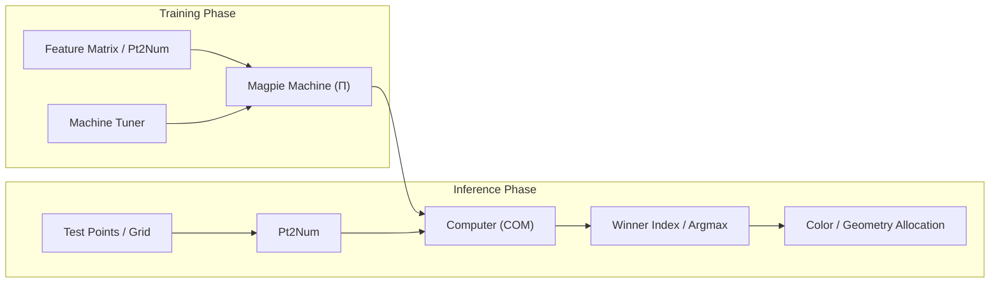

# Magpie Machine Learning Guide & Canonical Patterns

Synthesized from the official **Magpie v0.4.4** examples repository (`Magpie-Examples`):
- `MagPie-Classify by branchs.gh`
- `Magpie - Vanilla Arrows.gh`
- `Magpie - Vanilla Arrows5.gh`
- `Magpie 1D Kohonen'sMap.gh`
- `Magpie-Clustering.gh`
- `Magpie-Kohonen's Map 2D.gh`
- `Magpie-PCA.gh`
- `Magpie-T_SNE.gh`

---

## 1. Core Architecture & Philosophy

Magpie integrates **Accord.NET** machine learning models directly into Grasshopper's visual programming and dataflow paradigm. 

### The Machine (`Π`) Abstraction
Every learning algorithm in Magpie produces a compiled model object output labeled **`Π`** (Greek capital Pi / `Machine`). This encapsulates:
1. The trained model weights and internal hyperparameters.
2. The transformation kernel (normalizers, projection matrices, or neural weights).
3. The evaluation interface consumed downstream by the **`Computer`** component.



### Conversion Bridge: Points to Numbers & Numbers to Points
Because geometric points in Rhino Common are tuples `(X, Y, Z)` while Accord.NET algorithms operate on numeric vectors `double[]` and matrices `double[][]`:
- **`Points to Numbers` (`Pt2Num`)**: Converts Grasshopper 3D points into numeric trees/lists.
- **`Numbers to Points` (`Num2Pt`)**: Reassembles output coordinates or projections back into Grasshopper 3D points.

---

## 2. Canonical Machine Patterns

### Pattern 1: Supervised Classification via DataTree Branches
**File**: `MagPie-Classify by branchs.gh`

#### Invariant: Branch-as-Class Supervised Labeling
In Magpie, you do **not** need to feed an explicit list of text labels to train a classifier. When training data is structured into a Grasshopper DataTree with multiple branches:
- Branch `{0}`: Class 0 samples
- Branch `{1}`: Class 1 samples
- Branch `{2}`: Class 2 samples

The `Classification Machine` automatically infers the classes from the branch paths!

#### Wiring & Inference:
1. **Inputs**:
   - `Inputs` (`X`): Point samples grouped into branches via `Entwine` -> `Pt2Num`.
   - `Hidden Neurons`: Integer (e.g. `26` or `12`).
   - `Tuner`: From `Kernel Tuner` (`Iteration=3000`, `LearningRate=0.1`, `BiPolarity=True`).
2. **Inference with `Computer`**:
   - Connect `Classifier.Π` -> `Computer.Π`.
   - Sample space with `Rectangle Grid` -> `Pt2Num` -> `Computer.Input`.
   - `Computer.Output` produces class probability / output tensors per grid point.
3. **Argmax Classification via `Winner Index`**:
   - `Computer.Output` -> `Winner Index.Tensor`.
   - `Winner Index.Index` outputs the winning class index (`0`, `1`, `2`...).
   - Feed `Index` into Heteroptera's `Allocate by Index` (`i-Allocator`) to colorize the field by predicted class.

---

### Pattern 2: Deep Vector Field Regression (Vanilla Machine MLP)
**Files**: `Magpie - Vanilla Arrows.gh`, `Magpie - Vanilla Arrows5.gh`

#### Architecture:
`Vanilla Machine` creates a Multi-Layer Perceptron (MLP) capable of non-linear vector field regression (e.g. learning flow fields, directional forces, and magnitudes).

#### Hyperparameter Topology:
- **`Hidden Layers`**: Accepts a multiline text panel with integers for each layer:
  ```text
  25
  12
  ```
  This creates a 2-hidden-layer network with 25 neurons in layer 1 and 12 in layer 2.
- **`ActivationFunction` Enum**:
  - `0`: Bipolar Sigmoid (`BiSigmoid`)
  - `1`: Sigmoid
  - `2`: ReLU (`ReLu`)
  - `3`: Gaussian (`GaussianFunction`)
- **`LearnerType` Enum**:
  - `0`: Standard Backpropagation (`BackPropagationLearning`)
  - `1`: Resilient Backpropagation (`ResilientBackpropagationLearning` / Rprop) — fastest convergence for MLPs
  - `2`: Levenberg-Marquardt (`LevenbergMarquardtLearning`) — ideal for smooth non-linear curves

#### Field Evaluation Pipeline:
1. Training arrows: Start points ($X$) and end-minus-start vectors ($Y$) fed to `Vanilla Machine`.
2. Evaluation grid: Arbitrary canvas point grid fed to `Computer`.
3. Predictions: `Computer.Output` -> deconstruct into $(V_x, V_y)$ -> construct `Line` + `Vector Display Ex` for live real-time vector field visualization.

---

### Pattern 3: Kohonen Self-Organizing Maps (SOM 1D & 2D)
**Files**: `Magpie 1D Kohonen'sMap.gh`, `Magpie-Kohonen's Map 2D.gh`

#### 1D SOM (Curve Manifold Fitting):
- **Inputs**:
  - `Rows Count`: `1` (or `0` for Elastic Network mode).
  - `Column Count`: Number of neurons along the curve (e.g. `10`).
  - `Tuner`: `Iteration` (e.g. `1000`), `LearningRate` (`0.1`), `Radius` (neighborhood decay).
- **Outputs**:
  - `Neurons`: Weight coordinates of neurons -> `Num2Pt` -> `Interpolate` curve threading directly through the centroid manifold of the point cloud.
  - `Winners`: Index of best-matching neuron (BMU) for each input point -> `List Item` connects each sample point to its winning neuron with a line.

#### 2D SOM (Surface Manifold Net):
- **Inputs**:
  - `Column Count`: `10`, `Rows Count`: `8` (80 neurons arranged on a 2D topological grid).
- **Lattice Reconstruction**:
  - `KohMap.Neurons` -> `Partition List` (size = `Column Count`) -> `Num2Pt` -> `PolyLine`.
  - Generates a flexible 2D mesh/net that unrolls and conforms to complex non-linear 3D point surfaces.
- **Continuous Projection**:
  - Feeding arbitrary curves through `Pt2Num` -> `Computer` projects 3D spatial points directly onto the learned SOM manifold.

---

### Pattern 4: Clustering Machine (K-Means & Gaussian Mixture)
**File**: `Magpie-Clustering.gh`

#### Workflow:
1. **Model Selection**: Right-click on component to toggle between K-Means and Gaussian Mixture Model (GMM).
2. **Parameters**:
   - `Inputs` (`X`): Point cloud features.
   - `Clusters` (`N`): Number of target clusters $k$.
   - `Random Seed` (`S`): Reproducibility seed.
3. **Outputs**:
   - `ClusterNumber` (`I`): Direct cluster integer IDs for training data.
   - `Mean` (`M`): Centroids of the $k$ clusters.
   - `Scores` (`S`): Probabilistic cluster assignment scores (soft clustering in GMM).
4. **Spatial Boundary Inference**:
   - Pass an ambient `Rectangle Grid` through `Computer` -> `Winner Index` to compute continuous Voronoi/cluster territory boundaries.

---

### Pattern 5: Principal Component Analysis (PCA)
**File**: `Magpie-PCA.gh`

#### Analysis & Coordinate System Alignment:
1. **Inputs**:
   - `Data` (`X`): 3D point cloud or high-dimensional features.
   - `Dimension` (`D`): Target dimensions (e.g. `2` or `3`).
2. **Outputs**:
   - `Result Vectors` (`R`): Transformed coordinates in principal component space.
   - `Mean` (`M`): Center of mass of the point cloud.
   - `EigenVector` (`A`): Direction vectors of principal axes.
   - `Proportions` (`P`): Percentage of total variance captured by each principal component.
3. **Geometric Principal Axis Reconstruction**:
   $$\text{Axis Line} = [\text{Mean} - \lambda \cdot \mathbf{v}, \; \text{Mean} + \lambda \cdot \mathbf{v}]$$
   Using Grasshopper arithmetic (`A-B` and `A+B`), the eigenvectors are drawn as physical 3D axes passing through the dataset center.
4. **Subspace Projection via `Computer`**:
   - Arbitrary geometry (e.g. 3D circles or sweeps) can be mapped into the PCA projection space using `Computer`.

---

### Pattern 6: Non-Linear Manifold Embedding (T-SNE)
**File**: `Magpie-T_SNE.gh`

#### High-Dimensional Feature Compression:
1. **Inputs**:
   - `Data` (`X`): Matrix of high-dimensional samples (e.g. bounding box intervals and geometric moments).
   - `Dimension` (`D`): Embedding dimensions (`2` or `3`).
   - `Perplexity` (`P`): [5–50] Balance between local clusters vs global layout (default: `20.0`).
   - `Theta` (`T`): [0–1] Barnes-Hut approximation speed/accuracy trade-off (default: `0.5`).
2. **Morphological Animation Pattern**:
   - High-dimensional points ($P_\text{initial}$) and T-SNE embedding points ($P_\text{embedded}$) are linked via `Vector 2Pt` (`Vec2Pt`).
   - Fed into `Move` with a slider scalar to morph interactively from high-dimensional space into the low-dimensional manifold.

---

## 3. Summary of Tuner Hyperparameters

The `Machine Tuner` / `Kernel Tuner` component configures training dynamics:

| Parameter | Type | Default | Description |
| :--- | :--- | :--- | :--- |
| `Iteration` | Integer | `100`–`5000` | Maximum training epochs before stopping. |
| `LearningRate` | Double | `0.01`–`0.1` | Step size during gradient descent or Levenberg-Marquardt damping factor. |
| `Alpha` | Double | `0.2`–`0.5` | Momentum rate for backpropagation algorithms. |
| `Seed` | Integer | Any integer | Pseudo-random initialization seed. |
| `Radius` | Double | Dynamic | Initial neighborhood radius for Kohonen SOM learning. |
| `BiPolarity` | Boolean | `True` | Bipolar input scaling $[-1, +1]$ vs standard $[0, 1]$. |
