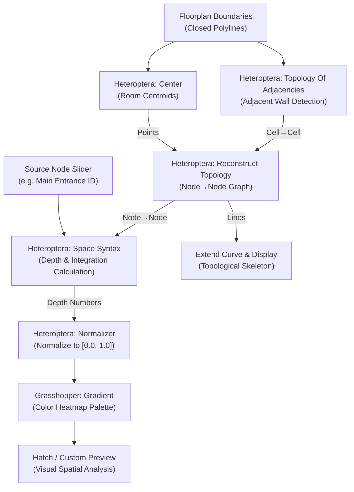

# Space Syntax & Topological Graph Analysis in Grasshopper

This guide explains the architectural principles, data tree structures, and wiring recipes for performing **Space Syntax analysis** inside Rhino Grasshopper using the **Heteroptera** plugin.

---

## 1. Background & Principles

Space Syntax is an architectural research method that analyzes spatial layouts and human movement patterns by treating architectural spaces as a network of topological relationships rather than mere Euclidean distances.

### Key Metrics
- **Topological Depth ($D_i$)**: The minimum number of steps (doorways/transitions) required to reach space $j$ from space $i$.
- **Mean Depth ($MD_i$)**: The average number of steps from space $i$ to all other accessible spaces in the network:
  $$MD_i = \frac{\sum_{j=1}^{n} D(i, j)}{n - 1}$$
- **Relative Asymmetry (RA) & Integration**:
  Measures how central or accessible a room is relative to the entire system. Low mean depth corresponds to high integration (accessible public zones), while high mean depth corresponds to low integration (segregated private rooms).
- **Choice / Betweenness**:
  Measures the frequency with which a room or corridor falls on the shortest path between any two rooms.

---

## 2. The Topological Data Tree Convention

Heteroptera represents spatial networks in Grasshopper Data Trees:

```
Node→Node (Adjacency Tree)
├── {0} -> [1, 2]     (Room 0 connects to Room 1 and Room 2)
├── {1} -> [0, 3]     (Room 1 connects to Room 0 and Room 3)
├── {2} -> [0, 3]     (Room 2 connects to Room 0 and Room 3)
└── {3} -> [1, 2]     (Room 3 connects to Room 1 and Room 2)
```

---

## 3. The Canonical Space Syntax Pipeline



---

## 4. The Reconstruction Invariant

> [!IMPORTANT]
> **Never pipe `Topology Of Adjacencies.Cell→Cell` directly into `Space Syntax.Node→Node`.**
> 
> Raw planar boundary adjacency can contain naked edges or disconnected zones with unindexed branches. Always pass the raw adjacency tree through **`Reconstruct Topology`** first. This guarantees:
> 1. Continuous integer indexing (`{0}`, `{1}`, `{2}`, ...).
> 2. Synchronized physical lines connecting room centroids.
> 3. Clean graph traversal without runtime null pointer exceptions.

---

## 5. Python Synthesis Example

You can synthesize this entire pipeline programmatically using `gh_toolkit`:

```python
from gh_toolkit import GHBuilder

builder = GHBuilder(name="AutomatedSpaceSyntax")

# One-call pipeline generation
ids = builder.add_space_syntax_pipeline(start_pivot=(100, 100))

# Save directly to native formats
builder.save_ghx("SpaceSyntax.ghx")
builder.save_gh("SpaceSyntax.gh")
```
